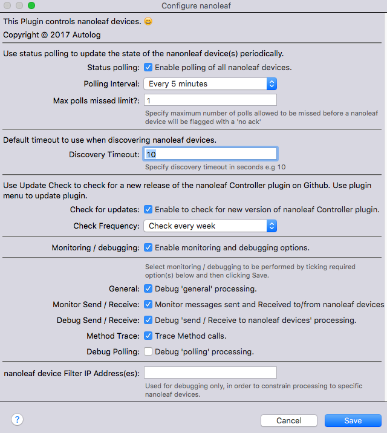
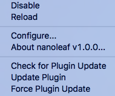
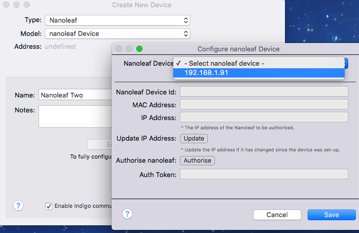
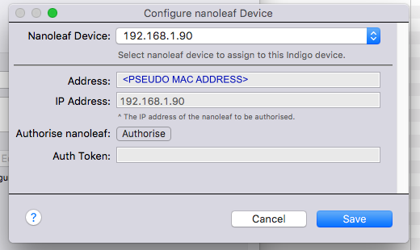
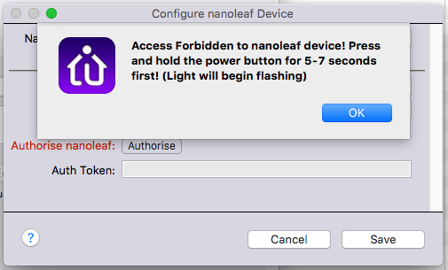
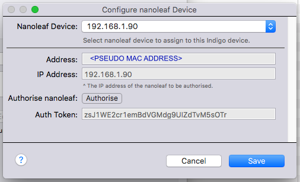
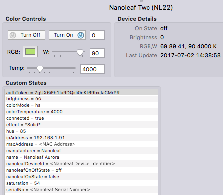
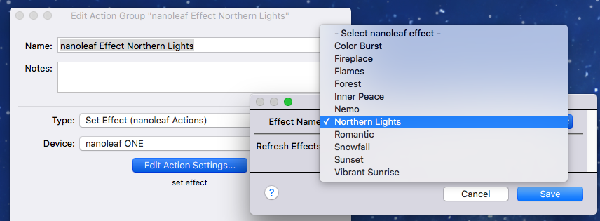

# nanoleaf V1 Controller

## Introduction
The Autolog nanoleaf Controller is a plugin for the Indigo (version 7+) home automation system (http://indigodomo.com) that enables you to control nanoleaf devices from Indigo. It enables local LAN control of nanoleaf Devices without having to use an internet connection.

The Version 1 series of the plugin is implemented using Indigo Dimmer Devices to control the nanoleaf devices and fully supporting the new built-in RGBW controls in Indigo 7. In addition to the standard controls, the plugin provides a mechanism to discover nanoleaf devices and to set  effects already defined on the nanoleaf device.

The plugin makes extensive use of the code base (modified) of the nanoleaf library by Software-2 for which much thanks are due :) - see (https://github.com/software-2/nanoleaf)

It is **strongly recommended** to read this documentation to familiarise yourself with the how the plugin works.

## Installation
### Prerequisites
This version of the nanoleaf Plugin controls nanoleaf Aurora devices running at least version 1.5.0 of the firmware. You may need to do a firmware update when you first get your nanoleaf Aurora device. This Plugin needs some nanoleaf Auroras to control!

The latest version of the plugin has been developed and tested on OS X El Capitan (10.11.6) and also tested on macOS Sierra (10.12.6).

### Installation
Download and install the plugin as normal for Indigo plugins.

### Plugin Configuration

When the plugin starts for the first time, the Configuration dialogue will be displayed. This dialogue is also available via the main Indigo menu *Plugins > nanoleaf > Configure...*.

The plugin configuration dialogue has a number of options:

* **Status Polling
 & Polling Interval**
    Tick to enable polling of the nanoleaf devices and select the Polling Interval from the pull down.
 Polling is used to detect external changes to the Auroras from for example, the nanoleaf iOS App. Typical values might be *Every 30 Seconds* or *Every Minute*. 

* **Max polls missed limit**
    Specify maximum number of polls allowed to be missed before a nanoleaf device will be flagged with a *'no ack'*. This is used to identify nanoleaf devices that have disappeared from the local network e.g because it has been inadvertantly physically switched off.    

* **Default Durations
**
    Specifies separate default durations to be used if not otherwise specified (See the description of these duration settings in the Device Configuration section)

* **Update Check**
    Use Update Check to check for a new release of the nanoleaf plugin on Github. Use plugin menu (see later) to update plugin.
    Check tick box to enable checks for updates and select frequency (daily or weekly).

* **Monitoring / debugging**
    These options are to support monitoring and debugging. All logging is now done to Indigo 7 standards and to a separate file that can be accessed by clicking on the Show Events Logs Folder button in the Indigo Event Log window. The log file is *plugin.log* in the *com.autologplugin.indigoplugin.nanoleafcontroller* folder. This folder also contains date stamped logs from the previous five days.
    Logging is not normally required but can be useful for fault finding and debugging.

* **nanoleaf device Filter IP Address
(es)**
    Used to filter the processing to one or more nanoleaf devices (mainly for testing and debugging purposes). If a nanoleaf device's IP address is specified, any messages sent to or received from other devices not in the list will be ignored. If you send a command (e.g. Turn On) to another nanoleaf device while the filter is active, then this will cause an error warning message to be displayed in the Indigo Event log.

### Plugin Menu

The plugin menu, in addition to the standard items, has additional items for update checking:

* **Check for Plugin Update**

    Select this item to perform an immediate check for a plugin update

* **Update Plugin**

    Select this item to perform a plugin update. The update will only proceed if there is a newer version available.

* **Force Plugin**

    Select this item to force a plugin update. The update will effectively refresh the current version if there isn't a newer one available or update to a newer one if there is.

### Device Configuration

All nanoleaf devices on the local network are discovered automatically by the plugin when it starts up. The discovery period defaults to 30 seconds.

On starting the plugin for the first time, the plugin will:

* Start discovery to detect nanoleaf devices on the local network.

Once the plugin has discovered nanoleaf devices, this is reported in the Indigo log.

To create a new nanoleaf device, perform the standard New... device option form the Indigo UI.

The configuration options are:

* **Nanoleaf Device**

    Select an available nanoleaf device that has been previously discovered by the plugin. If there are no nanoleaf devices available to assign to the new Indigo device, then the list will show the message *- No available nanoleaf devices discovered -*

    Once you have selected a nanoleaf device from the list, the configuration dialogue will show:

* **Address**

    This looks like a MAC Address but is in fact a random identifier generated by the nanoleaf device that will change only when the Aurora is reset. The the only time it changes is when authorization information is erased (reset), which implies a user must set things up again. If this happens you will have to add a new Indigo device. 

* **IP Address**

    This is the IP Address of the nanoleaf device on your network. 

* **Authorise**

    For the plugin to be able to control the nanoleaf device, it has to be authorised. You do this by pressing and holding the power button on the nanoleaf device for 5-7 seconds until the indicator light on the nanoleaf device starts flashing. If you don't do this you will get an error:

    
     
    As soon as the indicator light on the nanoleaf device starts flashing, you can let go of the power button (the light will stop flashing) and you can then press the *Authorise* button. Assuming the authorisation works, then the dialogue will show the following.

    

    You should see the unique genearted *Auth Token* which the plugin will use when communicating with the nanoleaf device. Now press Save to let the plugin complete the setup of the Indigo nanoleaf device.

## Usage

### Start Up

When Indigo is restarted or the pluguin is reloaded, the plugin will run a Discovery of nanoleaf devices on the local network (as previously noted in the section above).

The UI Status of nanoleaf devices will initially be shown as 'No Ack' (No Acknowledgement). Once a status update has been received, the standard *light on* or *light off* symbols will be shown as appropriate.

### Indigo UI Home Window Device Info

The discovered nanoleaf devices reside in whatever folder was used when the device was created within the Indigo Home Window (that lists device). The relevant Device info listed in the Window is as follows:

* **State**

    Shows nanoleaf device state, normally an *on* or *off* icon and dimming state from 0 to 100. Can also be a red dot with 'No Ack' (No Acknowledgement) indicating communication has been lost with the nanoleaf device. 

* **Device Name**

    The name of the specified by you when the device was created.

* **Address**

    The random identifier address of the physical nanoleaf device.

* **Notes**
    User specified.

* **Folder**

    User specified.

* **Model**

    This is the nanoleaf device model retrieved from the physical device by the plugin:

    * NL22

* **Protocol**

    nanoleaf :)

* **Firmware**

    Shows the nanoleaf firmware version.

### Built-In Indigo Controls

The plugin is implemented as an Indigo Dimmer Device, so the built-in Indigo controls can be be used to control the nanoleaf(s):

The various built-in controls are described below:

* **Turn Off**
    Will turn off the nanoleaf device

* **Turn ON**
    Will turn on the nanoleaf device

* **Brightness Level**
    The field next to the *Turn On* button contains the overall nanoleaf *brightness level* 

* **RGB**
    The color swatch represents the current colour of the nanoleaf device. Clicking on the color swatch launches the Color Picker. You can choose different color modes e.g. RGB Sliders, HSB Sliders etc. The plugin handles the translation of the nanoleaf color model (HSBK) to and from the Indigo color model (RGBW). Whilst there is for the most part a vey good correlation between the two models, there can at times be slight deviations. Adjusting the sliders will alter the color of the nanoleaf device and put the device into *hs* (hue/saturation) mode.

* **W**
    *W* represents White Level and adjusting this alters the brightness of the nanoleaf device and puts the nanoleaf device into *ct* (color temperature) mode. You can also directly enter the White level required in the adjacent field.

* **Temp**
    This is the *White Temperature (kelvin)* of the nanoleaf device and puts the nanoleaf device into *ct* (color temperature) mode. You can also directly enter the *White Temperature (Kelvin)* required in the adjacent field. This will also be adjusted according to the above table

### Device Actions
The nanoleaf devices can be controlled using the built-in standard Indigo Device Actions > Light/Appliance Controls:

* All Off
* All Lights On
* All Lights Off
* Turn On
* Turn Off
* Toggle On/Off
* Set Brightness
* Brighten by %
* Dim by %
* Match Brightness
* Set RGBW Levels
**Note:** Pending a further required Indigo update (to be available post version 7.0.3) to resolve an issue with how the plugin can understand the user input, it is not possible to set the color via an Action.

### nanoleaf Actions

The Plugin provides two additional actions under *'nanoleaf Actions’*:
* Set Effect
* Discover nanoleaf Devices

#### Discover nanoleaf Devices (Action)

    Running this action will cause the plugin to try and discover nanoleaf devices on the local network. Once new nanoleaf devices are found, You can use the *NEW...* command from the main UI to add a new device.

#### Set Effect (Action)

    Use this action to select an availbale effect already defined on the physical nanoleaf device. When you run the action the effect will be run on the nanoleaf device.

    Note that communication must have been successfully made to the nanoleaf device for the dynmaic effect list to be built for selection in the action.

### States

The plugin provides the following states:

*To Be Advised*

### Scripting

The nanoleaf plugin's ID is 'com.autologplugin.indigoplugin.nanoleafcontroller'.

*Scripting example to follow*
